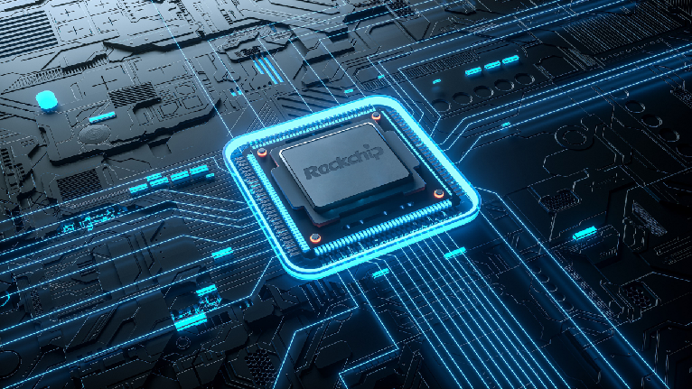
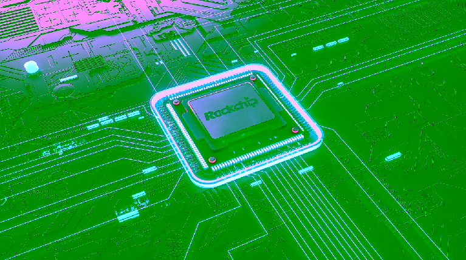
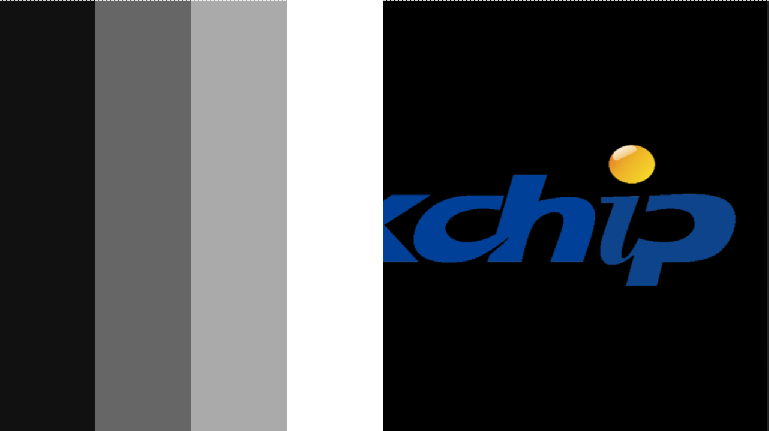
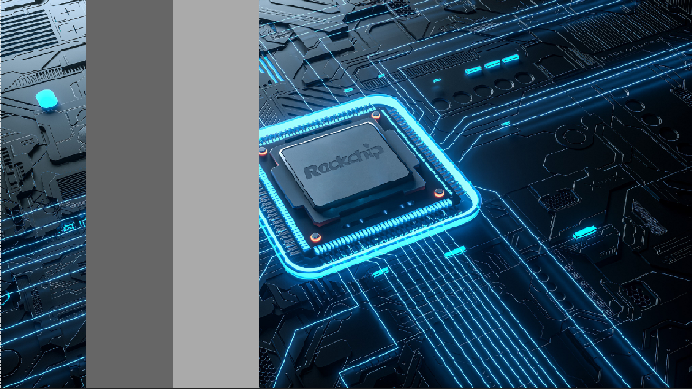
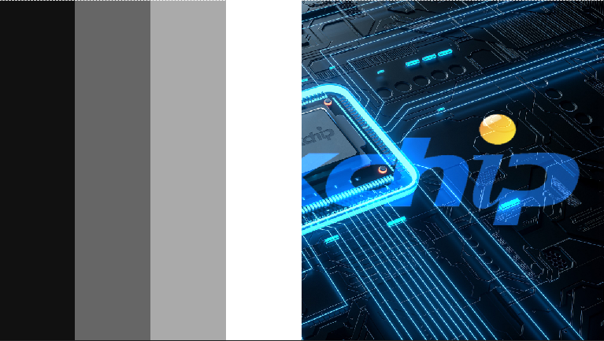
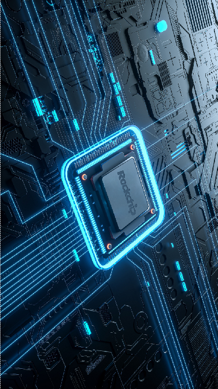
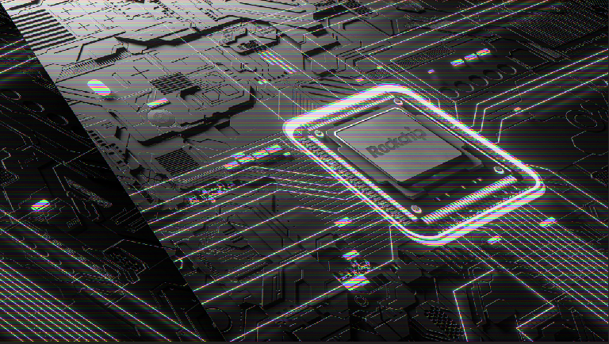
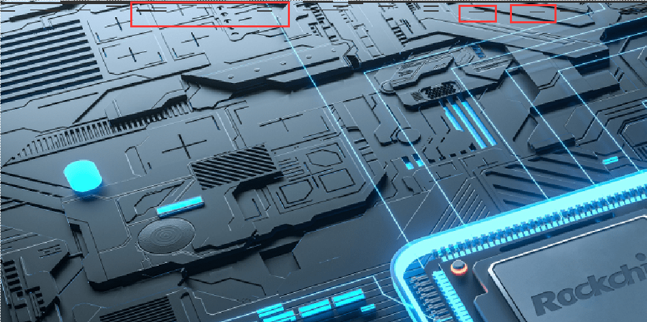

# RGA FAQ

File No.：RK-PC-YF-0003

Current Version：V1.1.0

Finish Date：2022-12-21

Security Class：□Top-Secret   □Secret   □Internal   ■Public

---

**Disclaimer**

This document is provided “as is” and Fuzhou Rockchip Electronics Co. Ltd (“the company”) makes no express or implied statement or warranty as to the accuracy, reliability, completeness, merchantability, specific purpose and non-infringement of any statement, information and contents of the document. This document is for reference only.

This document may be updated without any notification due to product version upgrades or other reasons.

**Brand Statement**

Rockchip, RockchipTM icon, Rockchip and other Rockchip trademarks are trademarks of Fuzhou Rockchip Electronics Co., Ltd., and are owned by Fuzhou Rockchip Electronics Co., Ltd.

All other trademarks or registered trademarks mentioned in this document are owned by their respective owners.

**Copyright © 2021 Fuzhou Rockchip Electronics Co., Ltd.**

Beyond reasonable use, without the written permission, any unit or individual shall not extract or copy part or all of the content of this document, and shall not spread in any form.


Fuzhou Rockchip Electronics Co., Ltd.

Address: No. 18 Building, A District, No.89,software Boulevard Fuzhou,Fujian,PRC

Website: [www.rock-chips.com](http://www.rock-chips.com)

Customer service tel.: +86-4007-700-590

Customer service fax: +86-591-83951833

Customer service e-mail: [fae@rock-chips.com](mailto:fae@rock-chips.com)

---

**Readership**

This document is intended for:

- Technical support engineers
- Software development engineers

**Revision History**

| **Date**   | **Version** | **Author** | **Description** |
| ---------- | -------- | -------- | ------------ |
| 2021/06/28 | 1.0.0    | Yu Qiaowei | Initial version.     |
| 2022/12/21 | 1.1.0 | Yu Qiaowei | Add multi_rga driver related cases. |
| | | | |


**Contents**

[TOC]


## Overview

For RGA driver and user-mode API librga, this document summarizes some common problems occurred when RGA hardware is called on RK platform to realize graph drawing acceleration with OSD (On Screen Display) and GUI (Graphics User Interface).


## Version Description

### Hardware Version

RGA hardware consists of three versions: RGA1, RGA2, and RGA3. See section Introducions in [Rockchip_Developer_Guide_RGA_EN](./Rockchip_Developer_Guide_RGA_EN.md) for detailed platform information, supported functions, and restrictions.


### Software Version

The following only provides common version query methods. For details, please refer to [Rockchip_Developer_Guide_RGA_EN](./Rockchip_Developer_Guide_RGA_EN.md) —— Release Notes chapter.

#### librga

The API version number consists of major, minor, revision and build. The four levels of version number correspond to different levels of function update.

- version query

  The more common query methods are as follows:

  ```
  strings librga.so |grep rga_api |grep version
  ```

- update version

  When it is found that the version does not meet the requirements, you can obtain the source code or precompiled library files in the following ways.

  - github：

    https://github.com/airockchip/librga

  - Baidu Cloud：


​				https://eyun.baidu.com/s/3jJ9Aiz0


- RGA Driver


The driver version number consists of major, minor, revision and build. The four levels of version number correspond to different levels of function update. Usually HAL library and driver is matching in released SDK, version verification is done within librga, developers do not need to consider about version. If the following error occurs when librga is updated separately, you need to update the driver to the corresponding version.

- version query

  Different chip platforms have different opening paths for debug nodes. Usually, there are two paths as follows.

  ```
  cat /sys/kernel/debug/rkrga/driver_version
  cat /proc/rkrga/driver_version
  ```

- update version

  When it is found that the version does not meet the requirements, you can obtain the source code or precompiled library files in the following ways.

  - Baidu Cloud：

​				https://eyun.baidu.com/s/3dGhufEL


#### Version Correspondence

When using RGA, you need to confirm that the current operating environment can work normally. The following table shows the correspondence between commonly used librga and driver versions.

| librga版本    | 对应驱动                                                     | 硬件支持         |
| ------------- | ------------------------------------------------------------ | ---------------- |
| no version    | Driver in SDK                                                | RGA1、RGA2       |
| 1.0.0 ~ 1.3.2 | RGA Device Driver（kernel - 4.4 and above）<br/>RGA2 Device Driver（no version or v2.1.0） | RGA1、RGA2       |
| > 1.4.0       | RGA multicore Device Driver（v1.2.0 and above）              | RGA2、RGA3       |
| > 1.9.0       | RGA Device Driver（kernel-4.4 and above）<br/>RGA2 Device Driver（no version or v2.1.0）<br/>RGA multicore Device Driver（v1.2.0 and above） | RGA1、RGA2、RGA3 |

Usually the released SDK version matches, but because some applications depend on the higher version librga.so, you can use the following Baidu Cloud link to obtain the RGA module code update package:

https://eyun.baidu.com/s/3i6sbsDR

- update-to-MULTI_RGA

​		When the original driver is RGA Device Driver or RGA2 Device Driver, use this update package to update the driver to RGA multicore Device Driver and update the matching version of librga.

- MUTIL_RGA

  When the original driver is RGA multicore Device Driver, use this update package to update the driver version and update the matching version of librga.

- RGA2

  When the original driver is RGA2 Device Driver, use this update package to update the driver version and update the matching version of librga.

- RGA1

  When the original driver is RGA Device Driver, use this update package to update the driver version and update the matching version of librga.


## Debugging instructions

### HAL Logs

#### Log Switch

- Android

  Android supports using Android Property to configure whether librga enables HAL log printing:

  - enable log print：

  ```
  setprop vendor.rga.log 1
  logcat -s librga
  ```

  - set log level：

    The log level is divided into full print (0), DEFAULT (1), DEBUG (3), INFO (4), WRANING (5), ERROR (6).
  
  ```
  setprop vendor.rga.log_level 6
  ```
  
  

- Linux

  The Linux supports enabling/disabling HAL log printing by setting environment variables (librga 1.9.0 and above):

  - enable log print：

  ```
  export ROCKCHIP_RGA_LOG=1
  ```
  
  - set log level：
  
    The log level is divided into full print (0), DEFAULT (1), DEBUG (3), INFO (4), WRANING (5), ERROR (6).
  
  ```
  export ROCKCHIP_RGA_LOG_LEVEL=6
  ```
  
   

#### Log Description

- Init Log

When each process calls librga for the first time, it initializes a singleton of librga and prints information such as the current API version number.

```C++
E rockchiprga: rga_api version 1.9.0_[0]
```

When the driver version does not match the librga version, it will print the corresponding error log.

> When the driver version is lower, the compatibility mode will be started, and the following log will be printed when the singleton is initialized. At this time, you can consider updating the driver to the version indicated by the log, or you can continue to run in compatibility mode.

```shell
librga fail to get driver version! Compatibility mode will be enabled.

29 im2d_rga_impl rga_version_below_minimun_range_user_driver(310): The driver may be compatible, but it is best to update the driver to version 1.2.4. You can try to update the SDK or update the <SDK>/kernel/drivers/video/rockchip/rga3 directory individually. current version: librga 1.8.5, driver .
```

> When the librga version is low, some errors related to Invalid parameters will be returned through imStrError(), which indicates that the current librga version is too low and the librga version needs to be updated.

```
Invalid parameters: invaild GraphicBuffer, can not get fd and virtual address,
```


- running log

```C++
D librga  : <<<<-------- print rgaLog -------->>>>								//The parameters passed to librga are printed as follows.
D librga  : src->hnd = 0x0 , dst->hnd = 0x0 , src1->hnd = 0x0					//The handle passed in by the three channels (src、src1、dst).
D librga  : src: Fd = 00 , phyAddr = 0x0 , virAddr = 0xb400007431ed6040			//Parameters passed in src channel, representing DMA_FD, physical address and virtual address respectively.
D librga  : dst: Fd = 00 , phyAddr = 0x0 , virAddr = 0xb400007431b4f040			//Parameters passed in dst channel, representing DMA_FD, physical address, and virtual address respectively.
D librga  : src: Fd = -01 , buf = 0xb400007431ed6040, mmuFlag = 1, mmuType = 0	//The src channel configures the value for the type of memory passed and whether or not MMU is enabled, where the HAL selects the virtual address to pass into the driver.
D librga  : dst: Fd = -01 , buf = 0xb400007431b4f040, mmuFlag = 1, mmuType = 0	//The dst channel configures the value for the type of memory passed and whether or not MMU is enabled, where HAL selects the virtual address to pass in the driver.
E librga  : blend = 0 , perpixelAlpha = 1										//Blending mode and whether the image format includes an Alpha value.
D librga  : scaleMode = 0 , stretch = 0;										//scale mode (RGA1).
E librga  : rgaVersion = 3.200000  , ditherEn =0								//Hardware version, Y4 Dither enabled.
D librga  : srcMmuFlag = 1 , dstMmuFlag = 1 , rotateMode = 0					//MMU enable flag, rotation mode.
D librga  : <<<<-------- rgaReg -------->>>>									//Parameters configuration of the driver are printed as follows.
E librga  : render_mode=0 rotate_mode=0											//RGA rendering mode, rotation mode.
E librga  : src:[0,b400007431ed6040,b400007431fb7040],x-y[0,0],w-h[1280,720],vw-vh[1280,720],f=0	//Memory, image parameters, format information of src channel.
E librga  : dst:[0,b400007431b4f040,b400007431c30040],x-y[0,0],w-h[1280,720],vw-vh[1280,720],f=0	//Memory, image parameters, format information of dst channel.
E librga  : pat:[0,0,0],x-y[0,0],w-h[0,0],vw-vh[0,0],f=0						//Memory, image parameters, format information of pat/src1 channel. This channel is not used in current mode, therefore the parameters are set to 0.
//The following are some of the parameters that developers usually don't have to care about, which is to configure for librga different modes of the driver.
E librga  : ROP:[0,0,0],LUT[0]													//ROP and LUT configuration.
E librga  : color:[0,0,0,0,0]													//Colorkey configuration（max color, min color）, color-filling configuration (foreground color, background color, color-filling).
E librga  : MMU:[1,0,80000521]													//MMU configuration.
E librga  : mode[0,0,0,0]														//Palette、csc、colorkey configuration.
E librga  : Full CSC : en[0]													//Full csc enabled flag.
E librga  : gr_color_x [0, 0, 0]												// Color-filling configuration, corresponding the value of R, G, B.
```


### Driver Debug Node

#### Log Switch

- Debugging Node Address

The configurations of different SDK kernels are different. Generally, the debugging node of RGA exists in one or both of the following two directories:

- Use a kernel with the CONFIG_ROCKCHIP_RGA_DEBUG_FS compile option enabled by default.

```
/sys/kernel/debug
```

- Use a kernel with the ROCKCHIP_RGA_PROC_FS compile option enabled.

```
/proc
```

In addition to enabling by default, you can also modify the kernel compilation options according to your own project requirements to implement a custom RGA debug node path.


#### Debug node name

The name of the debug node on different drivers is different, and it will be unified as rkrga in subsequent updated drivers, and the name of rgax_debug has been deprecated.

| driver name                      | node path  |
| -------------------------------- | ---------- |
| RGA Device Driver                | rga_debug  |
| RGA2 Device Driver（no version） | rga2_debug |
| RGA2 Device Driver（v2.1.0）     | rkrga      |
| RGA multicore Device Driver      | rkrga      |


#### Debug node function

##### Overview

- rga_debug/rga2_debug

The rga_debug/rga2_debug nodes only support the running log enable/disable.

- rkrga

This version of the debugging node supports functions such as enabling/disabling the running log, load query, version query, hardware information query, and memory/task manager status query.


##### Running Log

###### Log Switch

- Debug node name

| driver name                     | node path       |
| ------------------------------- | --------------- |
| RGA Device Driver               | rga_debug/rga   |
| RGA2 Device Driver（no vesion） | rga2_debug/rga2 |
| RGA2 Device Driver（v2.1.0）    | rkrga/debug     |
| RGA multicore Device Driver     | rkrga/debug     |

- Debugging Description

The switching methods of debugging logs of different driver versions are the same, and they all operate on rga/rga2/debug nodes.

Taking RGA multicore Device Driver as an example, you can get the corresponding function description through the cat node in the corresponding directory:

```shell
/# cd /sys/kerne/debug/rkrga/
/# cat debug
REG [DIS]
MSG [DIS]
TIME [DIS]
INT [DIS]
CHECK [DIS]
STOP [DIS]

help:
 'echo reg > debug' to enable/disable register log printing.
 'echo msg > debug' to enable/disable message log printing.
 'echo time > debug' to enable/disable time log printing.
 'echo int > debug' to enable/disable interruppt log printing.
 'echo check > debug' to enable/disable check mode.
 'echo stop > debug' to enable/disable stop using hardware
```

> echo reg > debug：This command switches the printing of RGA register configuration information. When it is opened, the configuration of RGA register is printed.
>
> echo msg> debug：This command switches the printing of RGA register upper-layer configuration information. When it is opened, The parameters passed by the upper-level call to the RGA driver will be printed out.
>
> echo time> debug：This command switches the printing of RGA time information. When it is opened, the time taken for each rga call is printed.
>
> echo check> debug：This command switches the RGA internal test case. When it is opened, corresponding parameters are checked when RGA is working, mainly memory and alignment checks. If the following log is printed, the check is successful. If the memory exceeds the threshold, the kernel crashes. You can check whether there is a problem with src data or dst data through the print log before cash.
>
> echo stop> debug：This command switches the RGA working status. When it is opened, rga directly returns without working. A mode used in some special cases.
>
> echo int> debug：This command switches the printing of RGA register interrupt information. When it is opened, the current value of the interrupt register and state base will be printed after the RGA enters the interrupt.
>
> echo slt> debug：This command causes rga driver to perform an internal SLT case to test whether the RGA hardware is working well. If log “rga slt success !” is printed, it indicates that the function is working well.

- Switch Debugging Node

The opening and closing commands of log printing are the same. Each time you enter a command to switch the state (on/off), you can confirm the log through the cat debug node or the log information printed after entering the command ("open xxx" or "close xxx") Whether printing is turned on or off as expected.

> Take RGA multicore Device Driver as an example, open the running log 'msg'：

```shell
/# cd /sys/kernel/debug/rkrga/
/# cat debug
REG [DIS]
MSG [DIS]
TIME [DIS]
INT [DIS]
CHECK [DIS]
STOP [DIS]

help:
 'echo reg > debug' to enable/disable register log printing.
 'echo msg > debug' to enable/disable message log printing.
 'echo time > debug' to enable/disable time log printing.
 'echo int > debug' to enable/disable interruppt log printing.
 'echo check > debug' to enable/disable check mode.
 'echo stop > debug' to enable/disable stop using hardware
/# echo msg > debug
/# echo ref > debug
/# cat debug
REG [DIS]
MSG [EN]
TIME [DIS]
INT [DIS]
CHECK [DIS]
STOP [DIS]

help:
 'echo reg > debug' to enable/disable register log printing.
 'echo msg > debug' to enable/disable message log printing.
 'echo time > debug' to enable/disable time log printing.
 'echo int > debug' to enable/disable interruppt log printing.
 'echo check > debug' to enable/disable check mode.
 'echo stop > debug' to enable/disable stop using hardware
/# echo msg > debug
/# cat debug
REG [DIS]
MSG [DIS]
TIME [DIS]
INT [DIS]
CHECK [DIS]
STOP [DIS]

help:
 'echo reg > debug' to enable/disable register log printing.
 'echo msg > debug' to enable/disable message log printing.
 'echo time > debug' to enable/disable time log printing.
 'echo int > debug' to enable/disable interruppt log printing.
 'echo check > debug' to enable/disable check mode.
 'echo stop > debug' to enable/disable stop using hardware
```

> log printing:

```shell
/# echo reg > /sys/kerne/debug/rkrga/debug
/# dmesg -c						//For logs opened through nodes, the printing level is KERNEL_DEBUG. You need to run the dmesg command to view the corresponding logs on the serial port or adb.
[ 4802.344683] rga2: open rga2 reg!
/# echo reg > /sys/kernel/debug/rga2_debug/rga2
/# dmesg -c
[ 5096.412419] rga2: close rga2 reg!
```


###### Log Description

For RGA problem debugging, logs are needed to confirm work of RGA hardware. When HAL parameters are passed into the driver, the following logs describe the corresponding parameters. We usually use msg, reg or time mode for debugging.

- msg mode

  - RGA Device Driver、RGA2 Device Driver

  ```
  rga2: open rga2 test MSG!								//Open 'msg' log printing.
  rga2: cmd is RGA2_GET_VERSION							//Get version number, which queries hardware version the first time each process calls librga.
  rga2: cmd is RGA_BLIT_SYNC								//Current working mode.
  rga2: render_mode:bitblt,bitblit_mode=0,rotate_mode:0	//Render_mode: display calling interface, bitblit_mode: current blending mode（0：two-channel mode A+B->B, 1: three-channel mode A+B->C, rotate_mode: rotation angle.
  rga2: src : y=0 uv=b4000072cc8bc040 v=b4000072cc99d040 aw=1280 ah=720 vw=1280 vh=720 xoff=0 yoff=0 format=RGBA8888	
  														//Parameters of src channel of image data y:fd, uv:virtual address, v：vw * vh + uv, aw and ah：actual width and height, the actual area of image. operation, vw、vh:virtual width and height, the size of image itself, xoff、yoff: offset in the x and y directions, format：image format.
  rga2: dst : y=0 uv=b4000072cc535040 v=b4000072cc616040 aw=1280 ah=720 vw=1280 vh=720 xoff=0 yoff=0 format=RGBA8888	
  														//Parameters of dst channel of image data.
  rga2: mmu : src=01 src1=00 dst=01 els=00				//MMU enabled flag，0 for close，1 for open.
  rga2: alpha : flag 0 mode0=0 mode1=0					//Configuration of blending.
  rga2: blend mode is no blend							//Blend mode.
  rga2: yuv2rgb mode is 0									//Csc mode.
  rga2: *** rga2_blit_sync proc ***
  ```

  - RGA multicore Device Driver

    - Memory Manager Log

    ```
    rga: import buffer info:
    rga_common: external: memory = 0xb400007458406000, type = virt_addr
    													//memory：memory value，type：memory type
    rga_common: memory param: w = 1280, h = 720, f = RGBA8888(0x0), size = 0
    													//w/h/f：Describe the memory size in the form of image canvas, size: memory size
    rga_dma_buf: iova_align size = 3686400
    ```

    - Job Request Log

    ```
    rga: Blit mode: request id = 192732					//running mode and request id
    rga_debugger: render_mode = 0, bitblit_mode=0, rotate_mode = 0
        												//render_modedisplay calling interface，bitblit_mode: current blending mode（0：two-channel mode A+B->B, 1: three-channel mode A+B->C, rotate_mode: rotation angle.
    rga_debugger: src: y = 19 uv = 0 v = e1000 aw = 1280 ah = 720 vw = 1280 vh = 720
        												//Parameters of src channel of image data y:fd, uv:virtual address, v：vw * vh + uv, aw and ah：actual width and height, the actual area of image. operation, vw、vh:virtual width and height, the size of image itself.
    rga_debugger: src: xoff = 0, yoff = 0, format = 0x0, rd_mode = 1
        												//, xoff、yoff: offset in the x and y directions, format：image format, rd_mode：Current channel read/write data mode（1：raster，2：FBC，3：tile 16*16）.
    rga_debugger: dst: y=1a uv=0 v=e1000 aw=1280 ah=720 vw=1280 vh=720
        												//Parameters of dst channel of image data.
    rga_debugger: dst: xoff = 0, yoff = 0, format = 0x0, rd_mode = 1
    rga_debugger: mmu: mmu_flag=0 en=0					//MMU enabled flag，0 for close，1 for open.This configuration is disabled when called with rga_buffer_handle_t, and the driver chooses the optimal configuration.
    rga_debugger: alpha: rop_mode = 0					//alpha/ROP mode enable/disable.
    rga_debugger: yuv2rgb mode is 0						//CSC mode config
    rga_debugger: set core = 0, priority = 0, in_fence_fd = -1
        												//set_core：user mode specified core，priority：user mode specified priority，in_fence_fd：acquire_fence fd passed by user mode.
    ```

    - Hardware Matching Log

    ```
    rga_policy: start policy on core = 1
    rga_policy: start policy on core = 2
    rga_policy: start policy on core = 4				//Iterate over all core support cases.
    rga_policy: RGA2 only support under 4G memory!		//Corresponding to the log of the reason why the core does not support.
    rga_policy: optional_cores = 3						//The current request can match the hardware core collection.
    rga_policy: assign core: 1							//The hardware core identifier bound after matching.
    ```

    - Hardware Configuration Log

    ```
    rga3_reg: render_mode:bitblt, bitblit_mode=0, rotate_mode:0
    rga3_reg: win0: y = ffc70000 uv = ffd51000 v = ffd89400 src_w = 1280 src_h = 720
    rga3_reg: win0: vw = 1280 vh = 720 xoff = 0 yoff = 0 format = RGBA8888
    rga3_reg: win0: dst_w = 1280, dst_h = 720, rd_mode = 0
    rga3_reg: win0: rot_mode = 1, en = 1, compact = 1, endian = 0
    rga3_reg: wr: y = ff8e0000 uv = ff9c1000 v = ff9f9400 vw = 1280 vh = 720
    rga3_reg: wr: ovlp_xoff = 0 ovlp_yoff = 0 format = RGBA8888 rdmode = 0
    rga3_reg: mmu: win0 = 00 win1 = 00 wr = 00
    rga3_reg: alpha: flag 0 mode0=0 mode1=a0a
    rga3_reg: blend mode is no blend
    rga3_reg: yuv2rgb mode is 0
    ```

- ‘reg’ mode

```c++
rga2: open rga2 reg!									//Open 'reg' log printing.
rga2: CMD_REG											//Configuration of command register.
rga2: 00000000 00000000 00000040 000e1040
rga2: 00119440 00000000 00000500 02cf04ff
rga2: 00000000 00000000 00000000 00000000
rga2: 00000000 00000000 00000000 00000040
rga2: 000e1040 00119440 00000500 02cf04ff
rga2: 00000000 00000000 0000ff00 ffffffff
rga2: 00000007 00000000 00000000 00000101
rga2: 07a80000 00000000 07a800e4 00000000
rga2: CSC_REG											//Configuration of full csc register.
rga2: 00000000 00000000 00000000 00000000
rga2: 00000000 00000000 00000000 00000000
rga2: 00000000 00000000 00000000 00000000
rga2: CMD_READ_BACK_REG									//Read back of full command register.
rga2: 00000000 00000000 00000040 000e1040
rga2: 00119440 00000000 00000500 02cf04ff
rga2: 00000000 00000000 00000000 00000000
rga2: 00000000 00000000 00000000 00000040
rga2: 000e1040 00119440 00000500 02cf04ff
rga2: 00000000 00000000 0000ff00 ffffffff
rga2: 00000007 00000000 00000000 00000101
rga2: 07a80000 00000000 07a800e4 00000000
rga2: CSC_READ_BACK_REG									//Read back of full csc register.
rga2: 00000000 00000000 00000000 00000000
rga2: 00000000 00000000 00000000 00000000
rga2: 00000000 00000000 00000000 00000000
```

- ‘time’ mode

  - rga2

  ```
  rga2: sync one cmd end time 2414					//Print the RGA. hardware time of the work,in us.
  ```

  - multi

  ```
  rga3_reg: set cmd use time = 196					//Time elapsed from start processing request to configuration register.
  rga_job: hw use time = 554							//Time-consuming from hardware startup to hardware interrupt return.
  rga_job: (pid:3197) job done use time = 751			//Time-consuming from the start of processing the request to the completion of the request.
  rga_job: (pid:3197) job clean use time = 933		//Time-consuming from the start of processing the request to the completion of the request resource processing.
  ```


##### Version Information Query

Use the following commands to query the current driver name and driver version:

```
/# cat driver_version
RGA multicore Device Driver: v1.2.23
```


##### Load Query

Use the following command to query the RGA load status:

```
/# cat load
num of scheduler = 3									//The number of hardware cores currently equipped.
================= load ==================
scheduler[0]: rga3_core0
         load = 0%										//Core load ratio.
-----------------------------------
scheduler[1]: rga3_core1
         load = 0%
-----------------------------------
scheduler[2]: rga2
         load = 0%
-----------------------------------
```


##### Memory Manager Query

Use the following command to query the memory status in the memory manager:

```
/# cat mm_session
rga_mm dump:
buffer count = 3										//The number of buffers saved in the memory manager
===============================================================
handle = 34 refcount = 1 mm_flag = 0x2  tgid = 3210
virtual address:
         va = 0xb400007286e1c000, pages = 0x00000000ae081f65, size = 3686400
         iova = 0xffc70000, offset = 0x0, sgt = 0x00000000cc976f9e, size = 3686400, map_core = 0x1
         												//memory information
---------------------------------------------------------------
handle = 35 refcount = 1 mm_flag = 0x2  tgid = 3210
virtual address:
         va = 0xb400007286a95000, pages = 0x000000002f083efc, size = 3686400
         iova = 0xff8e0000, offset = 0x0, sgt = 0x0000000062bb1297, size = 3686400, map_core = 0x1
---------------------------------------------------------------
handle = 36 refcount = 1 mm_flag = 0x2  tgid = 3210
virtual address:
         va = 0xb40000728670e000, pages = 0x00000000785fef63, size = 3686400
         iova = 0xff550000, offset = 0x0, sgt = 0x00000000cdd7688d, size = 3686400, map_core = 0x1
---------------------------------------------------------------
```


##### Job Request Query

Use the following command in Job manager to request the status of the job:

```
/# cat request_manager
rga internal request dump:
request count = 1										//The number of job requests in the job manager.
===============================================================
------------------ request: 200073 ------------------
         set cmd num: 1, finish job: 0, failed job: 0, flags = 0x0, ref = 2
         												//Job request completion status.
         cmd dump:										//Job request information.
                 rotate_mode = 0
                 src: y = 25 uv = 0 v = e1000 aw = 1280 ah = 720 vw = 1280 vh = 720
                 src: xoff = 0, yoff = 0, format = 0x0, rd_mode = 1
                 dst: y=26 uv=0 v=e1000 aw=1280 ah=720 vw=1280 vh=720
                 dst: xoff = 0, yoff = 0, format = 0x0, rd_mode = 1
                 mmu: mmu_flag=0 en=0
                 alpha: rop_mode = 0
                 yuv2rgb mode is 0
                 set core = 0, priority = 0, in_fence_fd = -1
```


##### Hardware Information Query

Use the following command to query the current hardware information:

```
/# cat hardware
===================================
rga3_core0, core 1: version: 3.0.76831					//Parameters such as the hardware version equipped with the core and supported function options.
input range: 68x2 ~ 8176x8176
output range: 68x2 ~ 8128x8128
scale limit: 1/8 ~ 8
byte_stride_align: 16
max_byte_stride: 32768
csc: RGB2YUV 0xf YUV2RGB 0xf
feature: 0x4
mmu: RK_IOMMU
-----------------------------------
rga3_core1, core 2: version: 3.0.76831
input range: 68x2 ~ 8176x8176
output range: 68x2 ~ 8128x8128
scale limit: 1/8 ~ 8
byte_stride_align: 16
max_byte_stride: 32768
csc: RGB2YUV 0xf YUV2RGB 0xf
feature: 0x4
mmu: RK_IOMMU
-----------------------------------
rga2, core 4: version: 3.2.63318
input range: 2x2 ~ 8192x8192
output range: 2x2 ~ 4096x4096
scale limit: 1/16 ~ 16
byte_stride_align: 4
max_byte_stride: 32768
csc: RGB2YUV 0x7 YUV2RGB 0x7
feature: 0x5f
mmu: RGA_MMU
-----------------------------------
```


##### dump running data

Use the following command to dump the running data for debugging. You can write the next few frames of RGA data to the specified directory through the debugging node configuration. Without this node, it means that the current kernel does not support the kernel to write and write data.

- Set the dump data path, and when the dump operation data is enabled, it will be output to this folder.

```
/# echo /data/rga_image > dump_path
/# dmesg -c
rga_debugger: dump path change to: /data/rga_image
```

- Set the number of dump data frames.

```
/# echo 1 > dump_image
/# dmesg -c
rga_debugger: dump image 1

.... RGA running ....

/# dmesg -c
rga_debugger: dump image to: /data/rga_image/1_core1_src_plane0_virt_addr_w1280_h720_RGBA8888.bin
rga_debugger: dump image to: /data/rga_image/1_core1_dst_plane0_virt_addr_w1280_h720_RGBA8888.bin

/# ls /data/rga_image/
1_core1_dst_plane0_virt_addr_w1280_h720_RGBA8888.bin  1_core1_src_plane0_virt_addr_w1280_h720_RGBA8888.bin
														//Input (src), output (dst) running image data
```


## Q & A

This section introduces common questions about RGA in the form of Q&A. If the problem is not in this section, please sort out the relevant log and preliminary analysis information and submit it to the redmine platform for the engineer who maintains the RGA module to handle it.

### Performance Consulting

**Q1.1**：How to evaluate RGA efficiency?

**A1.1**： When RGA performs copying, the following formula can be used to calculate the theoretical time (this function only supports data copy evaluation):

​			Time required for a single image copy = width × height / number of pixels that RGA can process per second

​											= width × height / （number of pixels that RGA can process per clock cycle × RGA frequency）

​			For example, the theoretical consuming time of copying an image of 1920 × 1080 size with RGA (frequency set at 300M) is:

​						RGA1 ： 1920 × 1080 / （1 × 300000000） = 0.006912s

​						RGA2 ： 1920 × 1080 / （2 × 300000000） = 0.003456s

​						RGA3 ： 1920 × 1080 / （4 × 300000000） = 0.001728s

​			The actual consuming time depends on the type of memory used. The efficiency of different memory types from high to low is physical address > dma_fd > virtual address.			

​			When the system is in no load, the actual time consuming of physical address is about 1.1-1.2 times of the theoretical time consuming, the actual time consuming of dma_fd is about 1.3-1.5 times of the theoretical time consuming, and the actual time consuming of virtual address is about 1.8-2.1 times of the theoretical time consuming, and is greatly affected by CPU. In general, we recommend developers to use dma_fd as the memory type passed in, which achieves great balance between accessibility and efficiency. Virtual addresses are only used as a simple and easy-to-use memory type when learning about RGA. The following table shows the actual test data of different RGA frequencies when the system is in no load on RK3566.

​			**Test Environment**：

| Chip Platform | RK3566     |
| -------- | ---------- |
| System Platform | Android 11 |
| RGA Frequency  | 300 M      |
| CPU Frequency  | 1.8 Ghz    |
| GPU Frequency  | 800 M      |
| DDR Frequency  | 1056 M     |

​			**Test Data**：

| Resolution      | Memory type                  | Theoretical Time（us） | Actual Time（us） |
| ----------- | ------------------------- | -------------- | -------------- |
| 1280 × 720  | GraphicBuffer（cache）    | 1,536          | 2,620          |
| 1280 × 720  | GraphicBuffer（no cache） | 1,536          | 2,050          |
| 1280 × 720  | Drm buffer（cache）       | 1,536          | 2,190          |
| 1280 × 720  | Physical address（Drm）   | 1,536          | 2,000          |
| 1920 × 1080 | GraphicBuffer（cache）    | 3,456          | 5,500          |
| 1920 × 1080 | GraphicBuffer（no cache） | 3,456          | 4,180          |
| 1920 × 1080 | Drm buffer（cache）       | 3,456          | 4,420          |
| 1920 × 1080 | Physical address（Drm）   | 3,456          | 4,100          |
| 3840 × 2160 | GraphicBuffer（cache）    | 13,824         | 21,500         |
| 3840 × 2160 | GraphicBuffer（no cache） | 13,824         | 15,850         |
| 3840 × 2160 | Drm buffer（cache）       | 13,824         | 16,800         |
| 3840 × 2160 | Physical address（Drm）   | 13,824         | 15,600         |


**Q1.2**：The theoretical formula only provides the evaluation method of copying, so how to evaluate other modes?

**A1.2**：Currently only the formula of copying is available for evaluating use. Other modes, such as scaling and cropping, can be evaluated by taking two images of larger resolution into the copy formula to calculate the time consumption, which usually fluctuates up and down according to the size of scaling and cropping. The time consumption of the mode with no change in resolution such as blending is about 1.1-1.2 times that of the copy mode. Because of the DDR bandwidth effect in actual scenarios, it is recommended that the actual test data in the target scenario prevail in the actual evaluation.


**Q1.3**：Why does RGA perform poorly in certain scenarios, taking up to twice as long as running a demo?

**A1.3**：The bus priority of RGA in the current RK platform is the lowest. When bandwidth resources are tight, for example, in the ISP running multiplex scenario, RGA cannot read and write data in DDR timely due to bandwidth resource shortage, resulting in a large delay and performance deterioration of RGA.


**Q1.4**：The efficiency of RGA cannot meet the needs of our products. Is there any way to improve it?

**A1.4**：The RGA frequency of the factory firmware of some chips is not the highest frequency. For example, the RGA frequency of chips such as 3399 and 1126 can be up to 400M. The RGA frequency can be improved in the following two ways:

- Set by command (temporarily modified, frequency restored upon device restart)

> Query RGA Frequency

```c++
cat /sys/kernel/debug/clk/clk_summary | grep rga  				//Query rga frequency.
```

> Modify RGA Frequency

```c++
echo 400000000 > /sys/kernel/debug/clk/aclk_rga/clk_rate		//Modify 400000000 to the needed frequency.
```

- Modify dts to modify RGA frequency（The frequency is still set after restart）

> The following example shows how to change RGA frequency in dts of RK3288. Users can change RGA frequency in the corresponding dts of other platforms.

```
diff --git a/arch/arm/boot/dts/rk3288-android.dtsi b/arch/arm/boot/dts/rk3288-android.dtsi
index 02938b0..10a1dc4 100644
--- a/arch/arm/boot/dts/rk3288-android.dtsi
+++ b/arch/arm/boot/dts/rk3288-android.dtsi
@@ -450,6 +450,8 @@
        compatible = "rockchip,rga2";
        clocks = <&cru ACLK_RGA>, <&cru HCLK_RGA>, <&cru SCLK_RGA>;
        clock-names = "aclk_rga", "hclk_rga", "clk_rga";
+       assigned-clocks = <&cru ACLK_RGA>, <&cru SCLK_RGA>;
+       assigned-clock-rates = <300000000>, <300000000>;
        dma-coherent;
 };
```


**Q1.5**：Does the RGA support querying the current RGA hardware utilization (load) through commands or interfaces?

**A1.5**：RGA multicore Device Driver supports viewing hardware load, for details, please refer to **Debugging Instructions——Driver Debugging Node——Debugging Node Function——Load Query**


**Q1.6**：Why are RGA calls in asynchronous mode slower than those in synchronous mode in some scenarios?

**A1.6**：RGA Device Driver, RGA2 Device Driver Since the identifier of the asynchronous mode of librga is an open device node, and a process of librga in singleton mode will only open one fd, so imsync() waits for all asynchronous modes of the process to run Will not return until finished. The RGA multicore Device Driver introduces a fence mechanism, so it is for real-time processing of a single request, and there will be no such problem.


**Q1.7**：The time cousuming when using virtual address to call RGA for copying is higher than memcpy, is there a way to optimize?

**A1.7**：In general, we do not recommend using virtual addresses to call RGA, because the efficiency of using a virtual address to call RGA in a scenario with a high CPU load will be greatly reduced. This is because the part of the virtual address to physical address page table in the RGA driver is calculated by the CPU, and the virtual address itself is converted to a physical address. The process of address page table itself is very time-consuming; in addition, the virtual address usually does not have a user-mode interface synchronization cache, so the driver will force the virtual address to synchronize the cache every frame. Therefore, it is generally recommended to call librga using a physical address or dma_fd.


**Q1.8**： When carrying 8G DDR, why is RGA efficiency worse than 4G?

**A1.8**：Since the current RGA1/RGA2 MMU only supports a maximum of 32 bits of physical address, therefore, with devices equipped with DDR of 4G or more, when a buffer with memory greater than 4G is passed to RGA, the RGA driver copies the data from the memory with the highest address to the memory reserved by swiotlb through the DMA interface and returns the corresponding address for RGA to read and write. After the work is finished, the result is copied to the previous high target address through dma, so the CPU involvement was increased, leading to a serious increase in the working time of the librga. If only RGA2/RGA1 is configured and the DDR of the device is greater than 4 GB, you are advised to use less than 4 GB memory when calling RGA to ensure RGA efficiency.

In the RGA Multicore Device Driver, the swiotlb mechanism will be disabled for access-restricted memory, and the caller will be notified directly to apply for a reasonable memory re-call by displaying the failure of the call to ensure the efficiency of RGA. Usually accompanied by the following logs:

> HAL Log：

```
RgaBlit(1483) RGA_BLIT fail: Invalid argument
Failed to call RockChipRga interface, please use 'dmesg' command to view driver error log.
```

> Hardware Matching Log：

```
rga_policy: invalid function policy							//Indicates that there are invalid parameters, which means that no hardware can access the memory configured by the current request.
rga_job: job assign failed									//Failed to match hardware core
rga_job: failed to get scheduler, rga_job_commit(403)
rga_job: (pid:3524) job clean use time = 19
rga_job: request[282567] task[0] job_commit failed.
rga_job: rga request commit failed!
rga: request[282567] submit failed!
```

> Driver Running Log：

```
rga_policy: start policy on core = 4
[82116.782252] rga_policy: RGA2 only support under 4G memory!
															//Indicates that the currently equipped RGA2 core only supports memory within 4G.
[82116.782256] rga_policy: optional_cores = 0
[82116.782258] rga_policy: invalid function policy
[82116.782260] rga_policy: assign core: -1
[82116.782262] rga_job: job assign failed
```

Therefore, for this scenario, it is recommended to apply for memory within 4G to call librga. The common way to allocate 4G memory can be viewed in the following sample code:

 **<librga_souce_path>/samples/allocator_demo/src/rga_allocator_dma32_demo.cpp**

 **<librga_souce_path>/samples/allocator_demo/src/rga_allocator_graphicbuffer_demo.cpp**


### Functions Consulting

**Q2.1**：How do I know what version of RGA is available on my current chip platform and what functions are available?

**A2.1**：See [《Rockchip_Developer_Guide_RGA_EN》](./Rockchip_Developer_Guide_RGA_EN.md) - Overview for RGA version and support information.

​			Different systems have different source code paths. librga source code directory paths in different SDKS are as follows:

​			Android 7.0 and above SDK：

​					hardware/rockchip/librga

​			Android 7.0 and below SDK：

​					hardware/rk29/librga

​			Linux SDK：

​					external/linux-rga


**Q2.2**：How to call RGA for hardware acceleration? Can there be a demo for reference?

**A2.2**：1). For API call interface, see [《Rockchip_Developer_Guide_RGA_EN》](./Rockchip_Developer_Guide_RGA_EN.md) - API.

​			2). Demo is located in sample/rga_im2d_demo. The demo internally implements most RGA API and implements corresponding RGA functions through command. It can also be used as a tool to test whether RGA works properly in some scenarios. It is recommended that developers who are learning about RGA for the first time run the demo and get the results to understand the actual functions of RGA, modify parameters in the demo to implement corresponding functions according to their own needs, and finally try to call RGA API in their own projects.

​			3). Common sample codes for common applications are in the samples directory:

├── **allocator_demo**：Memory allocator related sample code<br/>
├── **alpha_demo**：alpha blending, overlay related sample code<br/>
├── **async_demo**：Asynchronous mode related sample code<br/>
├── **config_demo**：Thread global configuration related sample code<br/>
├── **copy_demo**：Image handling, copy related sample code<br/>
├── **crop_demo**：image cropping and splicing related sample code<br/>
├── **cvtcolor_demo**：Image format conversion, color space conversion related sample code<br/>
├── **fill_demo**：image fill related sample code<br/>
├── **mosaic_demo**：mosaic related sample code<br/>
├── **padding_demo**：padding related sample code<br/>
├── **resize_demo**：Image resize related sample code<br/>
├── **rop_demo**：ROP related sample code<br/>
└── **transform_demo**：Image process related sample code<br/>


**Q2.3**：Support information of RGA？

​			**Q2.3.1**：What format is supported by RGA？

​			**A2.3.1**：For detailed support information, see  [《Rockchip_Developer_Guide_RGA_EN》](./Rockchip_Developer_Guide_RGA_EN.md) - Overview -  Image Format Supported to check the format support information of RGA for the corresponding chip version.  Users can also call **querystring(RGA_INPUT_FORMAT | RGA_OUTPUT_FORMAT);** to query the supported input and output formats of current hardware.

​			**Q2.3.2**：What scaling ratio is supported by the RGA？

​			**A2.3.2**：For detailed support information, see   [《Rockchip_Developer_Guide_RGA_EN》](./Rockchip_Developer_Guide_RGA_EN.md)  - Overview - Design Index to query scaling ratio supported by RGA for the corresponding chip version. Users can also call **querystring(RGA_SCALE_LIMIT);** to query the scaling ratio supported by current hardware.

​			**Q2.3.3**：What is the max resolution supported by RGA?

​			**A2.3.3**：For detailed support information, see  [《Rockchip_Developer_Guide_RGA_EN》](./Rockchip_Developer_Guide_RGA_EN.md)  - Overview - Design Index to query the max input and output resolution supported by RGA for the corresponding chip version. Users can also call **querystring(RGA_MAX_INPUT | RGA_MAX_OUTPUT);** to query the max input/output resolution supported by current hardware.

**A2.3**：In general, if you have any questions about RGA support, please refer to [《Rockchip_Developer_Guide_RGA_EN》](./Rockchip_Developer_Guide_RGA_EN.md), which provides detailed instructions on RGA support information.


**Q2.4**：How does the new version of librga differ from the old one and how to tell?

**A2.4**：Among all the released SDKs of the current RK platform, the old version of librga that cannot obtain the version number is mainly distributed, and the new version of librga that supports querying the version number.

​			The support and maintenance of the no version librga has been stopped. The main feature is that the SDK released before November 2020 is loaded with the old version librga. Some chip platforms, such as RK3399 Linux SDK released before June 2021 (V2.5 and below), are also with the old version librga. This version of librga cannot perfectly fit newer drivers and may have color deviation, abnormal format and other problems, so it is not recommended to use it together. When using a newer kernel, users are recommended to update the new version librga, and when using a newer version librga , kernel should be updated to match.

​			The support query version of librga is currently the main version of support and maintenance, the main feature is to add **im2d_api** directory under source directory. This version integrates with the old version librga, and introduces a simple and easy to use IM2D API, also called IM2D librga. The new version librga supports not only the new IM2D API, but also RockchipRga and C_XXX interfaces of older version. For details about API, see [《Rockchip_Developer_Guide_RGA_EN》](./Rockchip_Developer_Guide_RGA_EN.md). This version adds the software management version number, which can be queried through **querystring(RGA_VERSION);**.

​			Generally, for librga support information of old and new version, it is recommended to update the overall SDK to avoid dependency problems. It is strongly not recommended to use the new version librga with old driver or the old version librga with new kernel. It may cause obvious errors in certain scenario.


**Q2.5**：Does the RGA have alignment requirements?

**A2.5**：Different formats have different alignment requirements，the RGA hardware itself fetches the data of each line of the image in a word aligned manner，that is 4 bytes/32 bits. For example, the RGBA format itself has a single pixel storage size of 32 bit (4 × 8bit), so there is no alignment requirement. RGB565 format storage size is 16 bit (5bit + 6bit + 5bit), so it needs 2 alignment; RGB888 format storage size is 24 bit (3 × 8bit), so the format needs 4 alignment to meet the 32bit fetching requirement of RGA hardware; YUV format storage is relatively special, its own alignment requirement needs 2 alignment, Y channel single pixel storage size is 8bit, so YUV format needs 4 alignment to meet the 32bit fetching requirement of RGA hardware. UV channel according to 420/422 to determine the storage size of each four pixels, so the YUV format Y channel needs 4 alignment to meet the RGA hardware fetching requirements, then the YUV format needs 4 alignment; other unmentioned format alignment requirements are similar in principle. Note that the alignment in the question refers to the alignment requirements of width stride, the actual width and height of YUV format itself, offset due to the characteristics of the format itself is also required 2 alignment. See the [《Rockchip_Developer_Guide_RGA_EN》](./Rockchip_Developer_Guide_RGA_EN.md) , "Overview" - "Image Format Alignment Instructions" for specific alignment restrictions.


**Q2.6**：Can RGA support drawing more than one rectangular at a time, or performing multiple operations? How does RGA work?

**A2.6**：RGA can only work sequentially on hardware, that is, one configured task ends and the next configured begins. Therefore, instead of drawing multiple rectangular at a time, async mode can be used to configure the work of RGA to the underlying driver. RGA will store the work in a work queue managed by driver and complete them in sequence. When the upper layer needs to process the buffer, it calls **imsync()** to determine if the RGA hardware has completed its work.


**Q2.7：*Does the fill function of RGA support YUV format?

**A2.7**：Older versions librga do not support YUV format. Only newer versions librga with the following submission support this format. If there is no such submission please try to update the SDK to the latest version.

```
commit 8c526a6bb9d0e43b293b885245bb53a3fa8ed7f9
Author: Yu Qiaowei <cerf.yu@rock-chips.com>
Date:   Wed Dec 23 10:57:28 2020 +0800

    Color fill supports YUV format as input source.

    Signed-off-by: Yu Qiaowei <cerf.yu@rock-chips.com>
    Change-Id: I0073c31d770da513f81b9b64e4c27fee2650f30b
```

​			This function is the same as the RGB color fill API, which fills the color by configuring  RGB value of the color, except that the output can be set to YUV format.


**Q2.8**：Does RGA support YUYV format?

**A2.8**：Older version librga (librga in the SDK released before October 2020) do not support YUYV format, only newer versions librga (with ** im2d_API ** in the source directory) with the following submission support this format. If there is no such submission, please try to update the SDK to the latest version.

```
commit db278db815d147c0ff7a80faae0ea795ceffd341
Author: Yu Qiaowei <cerf.yu@rock-chips.com>
Date:   Tue Nov 24 19:50:17 2020 +0800

    Add support for Y4/YUV400/YUYV in imcheck().

    Signed-off-by: Yu Qiaowei <cerf.yu@rock-chips.com>
    Change-Id: I3cfea7c8bb331b65b5bc741956da47924eeda6e1
```


**Q2.9**：Does RGA support scaling of grayscale input and output?

**A2.9**：Older version librga (librga in the SDK released before October 2020) do not support this format, only newer version 1.2.2 of librga (with ** im2d_API ** in the source directory) supports grayscale input. If the librga version is lower than this, please try to update SDK to the latest version. Since the RGA hardware itself does not support grayscale format, the grayscale format used here is **RK_FORMAT_Y400**, which is represented as YUV format without UV channel. YUV with only Y channel is 256-order grayscale.

​			Since it is in the YUV format, we need to pay attention to the problem of the color gamut here. When converting CSC to YUV format in librga, the default is BT.601 limit range, and the Y channel of the limit range is not 0~255, which involves CSC conversion (RGB to YUV) When the output is in Y400 format, you need to pay attention to configuring the full range flag when converting the color gamut space.


**Q2.10**：Why does ROP code of RK3399 run on RV1126 without corresponding results?

**A2.10**：Although RGA on both RK3399 and RV1126 is RGA2-ENHANCE, their sub versions are different, and ROP function has been cut out of RV1126. For detailed function support information, see  [《Rockchip_Developer_Guide_RGA_EN》](./Rockchip_Developer_Guide_RGA_EN.md)  or call **querystring(RGA_FEATURE);** to query support  functions.


**Q2.11**：What is the reason for serious color difference (too pink or too green) in RGB and YUV format conversion, while other functions of RGA are normal.

​			Expectations：

​			

​			Actual result：

​			

**A2.11**：This is usually caused by a mismatch between librga and kernel. For detailed version description, see **A2.4**. The problem usually occurs after librga available on Github is used in SDK released before November 2020. Librga on Github is of new version, which does not match the older version RGA driver. Here, some configurations about color space have been changed, which causes the obvious color deviation.

​			There are two solutions to this problem: one is to update the SDK or RGA driver and keep librga matching with the driver; the other is to use the librga provided with SDK if the functions only available in the new version librga are not needed.

​			The rga module source code update package can be obtained through Baidu Netdisk: https://eyun.baidu.com/s/3i6sbsDR


**Q2.12**：How does RGA implement OSD overlay subtitle?

​			Expectations：

​			

**A2.12**：If the output is in RGB format, **imblend()** can be used to implement this, usually select src over mode, and the src channel image is overlaid on the dst channel image. If the output is in YUV format, ** imcomposite ()** can be used to implement this, usually select dst over mode, the src1 channel image is overlaid on the src channel image, and then output to the dst channel.

​			The blending principle of this function is **Porter-Duff blending model**. For details, see  [《Rockchip_Developer_Guide_RGA_EN》](./Rockchip_Developer_Guide_RGA_EN.md)  - API - Image Blending.

​			The reason RGA requires different configurations for different output formats is that RGA2 has three image channels: src, src1/pat, and dst, in which src channel supports YUV2RGB conversion, src1/pat and dst channel only supports RGB2YUV conversion. The blending inside RGA needs to be performed in RGB format. Therefore, in order to ensure that RGB images are overlaid on YUV images, src must be used as the overlaid background image YUV. Src1 is used as the overlaid RGB foreground image, and the blended RGB image is finally converted into YUV format output by dst channel.


**Q2.13**：Why brightness or numerical difference exists when RGA is called to implement YUV and RGB format conversion?

**A2.13**：The reasons can be roughly divided into two kinds:

​			1). When YUV and RGB interconversion configuration are the same, some pixel values will be slightly different (usually 1), which is caused by the formula accuracy difference when RGA hardware implements CSC function. The decimal accuracy of CSC formula of RGA1 and RGA2 is 8bit, and that of RGA3 is 10bit. In this case, the accuracy of some calculations will have ±1 error  when the results are rounded.

​			2). When the CSC modes configured for RGB2YUV and YUV2RGB conversion are different, the default CSC modes of RGB2YUV and YUV2RGB in the new version librga is BT.601-limit _range. When the corresponding **color_space_mode** member variable is incorrectly configured, the different configurations of the color space will result in large changes in interconversion. In the old version  librga, RGB2YUV is BT.601-full_range by default, and YUV2RGB is BT.709-limit_range by default. Due to the different color space configuration of the two kinds of conversions, there are great changes in interconversion.


**Q2.14**：How to configure the color space for format conversion in librga?

**A2.14**：Both versions of librga support configuring the color space for format conversion.

​			1). In the new version librga, see to the  [《Rockchip_Developer_Guide_RGA_EN》](./Rockchip_Developer_Guide_RGA_EN.md)  - API - Image Format Conversion, and focus on configuring the mode parameter.

​			2). In the old version librga, you need to modify the source code of librga, that is, yuvToRgbMode value in Normal/NormaRga.cpp, the corresponding parameters are as follows:

| Format Conversion | Color Space           | Parameters                     |
| -------- | ------------------ | ------------------------ |
| YUV2RGB  | BT.601-full_range  | yuvToRgbMode = 0x1 << 0; |
| YUV2RGB  | BT.601-limit_range | yuvToRgbMode = 0x2 << 0; |
| YUV2RGB  | BT.709-limit_range | yuvToRgbMode = 0x3 << 0; |
| RGB2YUV  | BT.601-full_range  | yuvToRgbMode = 0x2 << 4; |
| RGB2YUV  | BT.601-limit_range | yuvToRgbMode = 0x1 << 4; |
| RGB2YUV  | BT.709-limit_range | yuvToRgbMode = 0x3 << 4; |


**Q2.15**：Why does calling RGA to perform alpha overlay have no effect?

**A2.15**：Check whether the alpha value of the two input images is both 0xFF. When the alpha value of the foreground image in the overlay is 0xFF, the result is that the foreground image directly overwrites the background image. The result looks like there is no effect, but in fact it is a correct result.


**Q2.16**：Call RGA to perform alpha overlay. The alpha value of the foreground image is 0x0. Why is the result not completely transparent?

​			Foreground Image：（Black and white and rockchip alpha is 0x00）

​			

​			Expectations：

​			

​			Actual Results：

​			


**A2.16**：In normal configuration mode, default color value has been pre-multiplied by the corresponding alpha value, while the color value of the original image read directly has not been pre-multiplied by alpha value, so we need to add an extra flag bit when calling imblend to indicate that the color value of the image processed does not need to be pre-multiplied by alpha value. For details of calling method, see  [《Rockchip_Developer_Guide_RGA_EN》](./Rockchip_Developer_Guide_RGA_EN.md)  - API - Image Blending.


**Q2.17**：Can the IM2D API implement multiple functions in one RGA call?

**A2.17**：Yes, please refer to  [《Rockchip_Developer_Guide_RGA_EN》](./Rockchip_Developer_Guide_RGA_EN.md)  - API - Image process, and refer to the implementation of other IM2D API to understand the use of **improcess()**.


**Q2.18**：When RGA is called to perform image rotation, the output image is stretched?

​			Expectations：

​			

​			Actual Result：

​			

**A2.18**：When rotating 90° or 270°, if users do not want RGA to perform scaling, users should exchange the width and height of the image. Otherwise, the RGA driver defaults to the behavior of rotation + scaling, and the result is the effect of stretching.


**Q2.19**：RGB888 output scaling results show that the image is slanted and has black lines?

​			Input（1920 × 1080）：

​			

​			Output（1282 × 720）：

​			

**A2.19**：This problem is caused by alignment requirement, virtual width of RGB888 format needs 4 alignment, please check the configured image parameters. For alignment requirement, see **Q2.5**.


**Q2.20**：What cause the error that in some system processes, the output of RGA is fuzzy?

**A2.20**：Usually RGA exception does not cause the phenomenon of fuzzy screen, when this problem occurs, users need to figure out whether the problem is RGA problem. In some system processes, users need to confirm whether the RGA input data is abnormal, you can call **fwrite()** to write  memory data to file. before calling RGA, and check whether the source data is normal. If you're not familiar with how to write files, see the implementation of the **output_buf_data_to_file()** function in the **core/ rgautils.cpp ** directory.


**A2.21**：Small black or green stripes appear after calling RGA to process the image. What is the reason?

​			

**Q2.21**：This is caused by the buffer enabling the cache when using a call that is not a virtual address, and the cache is not synchronized before and after the CPU operation. If you don't know how to synchronize the cache, you can refer to the usage in samples/allocator_demo/src/rga_allocator_dma_cache_demo.cpp.


### HAL Error

#### IM2D_API Error

**Q3.1.1**： How to deal with the error of imcheck()?

```
check error! Invalid parameters: dst, Error yuv not align to 2, rect[x,y,w,h] = [0, 0, 1281, 720], wstride = 1281, hstride = 720, format = 0xa00(nv12)
output support format : RGBA_8888 RGB_888 RGB_565 RGBA_4444 RGBA_5551 YUV420/YUV422 YUV420_10bit/YUV422_10bit YUYV420 YUYV422 YUV400/Y4
```

**A3.1.1**：The imcheck() API serves as the verification API to call librga, which determines whether the parameters of the data structure to be passed to librga are correct, whether the function is supported, whether the hardware restrictions are triggered, etc. You can pass the error value of imcheck() as an argument to **IMStrError()** and the string returned is a detailed error message. which can be used to confirm which conditions were triggered or which parameters were wrong.

​			The error in this problem is caused by the alignment limitation of YUV format. Here, the width 1281 of the image is not 2 aligned, so the verification fails.


**Q3.1.2**：What is the error with the imstrError() error prompt that there are no specific parameters to print instructions?

```
Fatal error: Failed to call RockChipRga interface, please use 'dmesg' command to view driver error log.
```

**A3.1.2**：It means that the configuration has passed the im2d api verification and has been configured on the back-level driver. You can check the error report of the driver through dmesg.


#### RockchipRga API Error

**Q3.2.1**：How to deal with the error “Try to use uninit rgaCtx=(nil)”?

**A3.2.1**：1). The error is caused by the fact that called API finds that librga module has not been initialized and returns an error. In the current version, the error is usually caused by some older code still uses  RgaInit/RgaDeInit/c_RkRgaInit/c_RkRgaDeInit interface to manage the initialization of RGA module, and when the singleton mode used by the current version of API is abnormal DeInit, the error will occur. Users just need to remove the Init/DeInit related calls in the code.

​				2). This error will also be reported when the driver fails to probe successfully, or the access to the driver device node (/dev/rga) is restricted.


**Q3.2.2**：What causes the error “RgaBlit(1027) RGA_BLIT fail: Not a typewriter”?

**A3.2.2**：This error is usually caused by parameter errors. You are advised to check the scaling factor, whether virtual width is smaller than the sum of actual width and the offset in the corresponding direction, and whether the alignment meets requirements. It is recommended that new developed projects use IM2D API, which has a more comprehensive error detection mechanism, and is convenient for developers.


**Q3.2.3**：What causes the error “RgaBlit(1349) RGA_BLIT fail: Bad file descriptor”?

**A3.2.3**：This error is an ioctl error, indicating that the current fd passed to device node is invalid. Please try to update librga or confirm whether the RGA initialization process has been modified.


**Q3.2.4**：What causes the error “RgaBlit(1360) RGA_BLIT fail: Bad address”?

**A3.2.4**：The error is usually caused by a problem with the memory address of the src/src1/dst channel passed into the kernel (commonly out-of-bouns).See "Log Obtaining and Description" - "Driver Debug Node" in this document to open driver logging and locate the faulty memory.


**Q3.2.5**：What cause the log error “err ws[100,1280,1280]”、”Error srcRect“?

**A3.2.5**：The error is an obvious parameter error. “err ws” represents width stride parameter error. The parameters in the following "[]" are [X_offeset, width, width_stride] respectively.Here, because the sum of offset in X direction and width of the actual operation area is larger than the width stride, librga thinks there is a problem with the width stride and returns an error. Change the width stride to 1380 or  width to 1180.

​			After this error occurs, the following parameters are printed in logcat:

```C++
E librga  : err ws[100,1280,1280]											//Represent the width stride error.
E librga  : [RgaBlit,731]Error srcRect										//Represent the src channel error.
E rockchiprga: fd-vir-phy-hnd-format[0, 0xb400006eb6ea9040, 0x0, 0x0, 0]	//Input address (fd, virtual address, physical address, handle) of  corresponding src channel.
E rockchiprga: rect[100, 0, 1280, 720, 1280, 720, 1, 0]						//Image parameters of corresponding src channel are: X direction offset, Y direction offset, width of the actual operation area, height of the actual operation area, image width (virtual width), image height (virtual height), image format, size ( parameters currently not used) respectively.
E rockchiprga: f-blend-size-rotation-col-log-mmu[0, 0, 0, 0, 0, 0, 1]		//Represents the mode configuration in the call.
E rockchiprga: fd-vir-phy-hnd-format[0, 0xb400006eb2ea6040, 0x0, 0x0, 0]	//Parameters of corresponding dst channel.
E rockchiprga: rect[0, 0, 1920, 1080, 1920, 1080, 1, 0]
E rockchiprga: f-blend-size-rotation-col-log-mmu[0, 0, 0, 0, 0, 0, 1]
E rockchiprga: This output the user patamaters when rga call blit fail		//Error information.
```


### Kernel Errors

**Q4.1**：What causes the error “RGA2 failed to get vma, result = 32769, pageCount = 65537”?

**A4.1**：This error is usually caused by the fact that the actual memory size of virtual address is smaller than the memory size needed (that is, the memory needed for the image of current channel calculated according to parameters of image) when the RGA is called using the virtual address. Just check the size of the buffer. In some scenarios where the application and the call are not performed together, users can memset the size of image  before calling RGA, to confirm whether the problem is caused by insufficient memory size.

​			Usually by “rga2 map src0 memory failed”, the channel with memory problems can be confirmed, as shown in this case, the src channel triggered this error due to the actual application of buffer size only half the size of required for the image.


**Q4.2**：What causes the error ”rga2_reg_init, [868] set mmu info error“？

**A4.2**：This error represents a fd or virtual address conversion to physical address page table error, usually due to the size of the applied memory, the same as Q4.1.


**Q4.3**：Error “rga：dma_buf_get fail fd[328]“ usually refers to what exception occurs in the buffer？

**Q4.3**：This error is reported when the kernel passes through the interface of dma. It is recommended to check the process of applying for fd and verify that fd is available outside librga before using it to call RGA.


**Q4.4**：What cause the error “RGA2 failed to get pte, result = -14, pageCount = 112”、”rga2_reg_init, [868] set mmu info error“? After checking accroding to **Q4.1** 、**Q4.2**, the error remains the same. In this case, the physical address allocated by DRM is used. The memset passed to RGA through virtual address mapped by MMAP is correct.

**A4.4**：This problem is caused by the allocator DRM itself. The DRM itself judges that the user mode obtains the physical address, the kernel mode usually does not need the virtual address, so the corresponding kmap will be released when allocating buffer. Releasing kmap will not affect the virtual address mapping and use in the user mode. However, when the virtual address in user mode of this buffer was passed into the RGA driver and the driver perform conversion query of the physical address page table, the kernel crashes because kmap of the buffer has been released, or the corresponding page table entry can not be queried, or the wrong address is accessed.

​			For this scenario, DRM provides an interface flag bit for users to figure out whether the user mode wants DRM to release kmap, that is, whether to pass the mapped virtual address to kernel:

```
(1) drm buffer application options add ROCKCHIP_BO_ALLOC_KMAP definition.
+	/* keep kmap for cma buffer or alloc kmap for other type memory */
+   ROCKCHIP_BO_ALLOC_KMAP  = 1 << 4,
(2) When applying for drm memory, add drm buffer option ROCKCHIP_BO_ALLOC_KMAP.
	struct drm_mode_create_dumb arg;
	...
-	arg.flags = ROCKCHIP_BO_CONTIG;
+	arg.flags = ROCKCHIP_BO_CONTIG | ROCKCHIP_BO_ALLOC_KMAP;	//ROCKCHIP_BO_ALLOC_KMAP is valid only when used together with ROCKCHIP_BO_CONTIG.
	ret = drmIoctl(drm_fd, DRM_IOCTL_MODE_CREATE_DUMB, &arg);
```

​			And confirm whether the kernel contains the following submission, if not, please update SDK:

```
commit 1a81ee3e2d3726b9382ff2c48d08f4d837bc0143
Author: Sandy Huang <hjc@rock-chips.com>
Date:   Mon May 10 16:52:04 2021 +0800

    drm/rockchip: gem: add flag ROCKCHIP_BO_ALLOC_KMAP to assign kmap

    RGA need to access CMA buffer at kernel space, so add this flag to keep kernel
    line mapping for RGA.

    Change-Id: Ia59acee3c904a495792229a80c42f74ae34200e3
    Signed-off-by: Sandy Huang <hjc@rock-chips.com>
```


**Q4.5**：What causes the error “rga：Rga err irq! INT[701],STATS[1]”?

**A4.5**：This problem usually occurs when an exception occurs during RGA hardware execution. There are many reasons for the exception, such as memory out-of-bounds and abnormal configuration. If this problem occurs, you are advised to check whether the memory passed in is out of bounds.


**Q4.6**：What causes the error “rga: Rga sync pid 1001 wait 1 task done timeout”？

**A4.6**：There are many reasons for the hardware timeout error. You can rectify the fault as follows:

​			1). Check the overall process and ensure that no other modules or applications are locking or abnormally occupying the buffer. If the same buffer is abnormally occupied by other modules, RGA cannot read and write data properly. If the work cannot be completed within 2000ms, the driver returns with exception and report the error message.

​			2). Check the DDR bandwidth and utilization of current system. Because the bus priority of RGA is low, when the DDR load is full, if RGA is not completed within 2000ms, the driver returns with exception and report the error message.

​			3). Check whether other IP modules, such as ISP and vpu, have reported an error before the RGA timeout error occurs. If the hardware on the same bus is faulty, the RGA may fail to work properly. If the work cannot be completed within 2000ms, the driver returns with exception and report the error message.

​			4). Check current RGA frequency (see RGA frequency related operations in **Q1.4**). In some scenarios, the module on the same bus may lower the frequency thus affect RGA frequency. RGA frequency decrease will lead to the overall performance decline, if the work cannot be completed within 2000ms, the driver returns with exception and report the error message.

​			5). RGA of some chips is overclocked to a higher frequency, at which case RGA frequency rises but the voltage does not, leading to the overall performance of RGA decreases significantly and the work cannot be completed within the specified threshold. As a result,the driver returns with exception and report the error message. In this scenario, developers are advised to change the RGA frequency to proper frequency.  Overclocking will affect the stability and service life of the overall chip, so this behavior is strongly not recommended.

​			6). If no error is found in any of the above scenarios, try to write the data in the target memory to file after an RGA timeout error is reported, and check whether part of the data is written to RGA. If some data is written to RGA, reconfirm scenarios 1 to 5. This is obviously caused by insufficient RGA performance. If no data is written to the target memory by RGA, collect corresponding log information and related experiments, and contact RGA maintenance engineers.


**Q4.7**：What are the errors "rga_policy: invalid function policy" and "rga_job: job assign failed"?

**A4.7**：You can open the driver operation log to view error messages.

```
rga_policy: start policy on core = 4
[82116.782252] rga_policy: RGA2 only support under 4G memory!
															//标识当前搭载的RGA2核心仅支持4G以内的内存。
[82116.782256] rga_policy: optional_cores = 0
[82116.782258] rga_policy: invalid function policy
[82116.782260] rga_policy: assign core: -1
[82116.782262] rga_job: job assign failed
```
